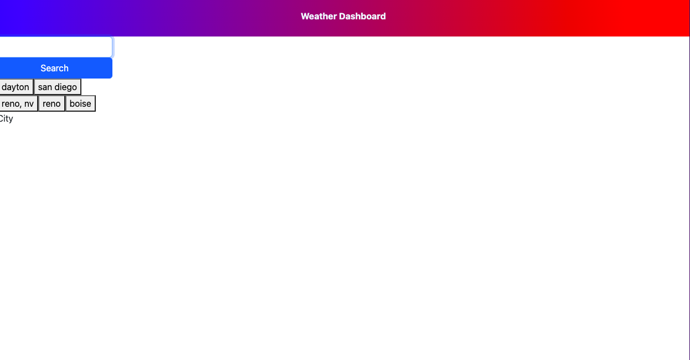

# Weather Dashboard
I have created a page where a user can search for a city and receive the weather information for that city for today's weather, as well as the five day forecast.  User can view recently searched cities, and when selected, user is presented with that cities weather information.

## Objective

 - When user searches for city, then they are presented with current and futures conditions.  That city will be added to the search history of the user up to the last five cities.
 - The current weather conditions show city name, date, icon for conditions, the temperature, humidity, winds speed, and UV index.
 - The UV severity of the UV is indicated by color.
 - The five day forecast presents the same information as the current day forecast except for UV.
 - If city from search history is selected, then the user is presented with that cities conditions.

## Live Link
https://zacharyfeltman.github.io/weekly-weather-forecast/

## Screenshot

